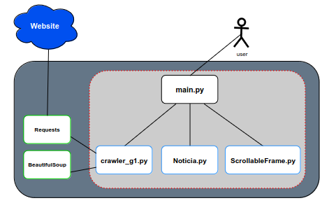
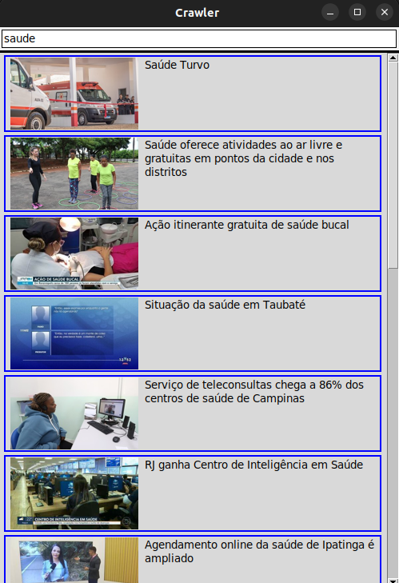

# CRAWLER
  

## Índice
- [Desenvolvedores](#desenvolvedores)
- [Descrição](#descrição)
- [Funcionalidade](#funcionalidade)
- [Visão Arquitetônica](#visão-arquitetônica)
- [Instruções](#instruções)
    - [Instalação de dependências](#instalação-de-dependencias)
    - [Execução do programa](#execução-do-programa)
    - [Utilização do programa](#utilização-do-programa)
- [Motivação](#motivação)
- [Tecnologias utilizadas](#tecnologias-utilizadas)

## Desenvolvedores
- Danilo Aparecido Namitala;
- Pedro Henrique dos Santos;
- Pedro Henrique Maciel Alves;
- Bruno Noberto Gomes;
- Gabriel Marcos Lopes.

## Descrição
Este é um trabalho desenvolvido para a disciplina de Sistemas Distribuídos do curso de Ciência da Computação da [Universidade Federal de Lavras](https://ufla.br/). Neste projeto, desenvolvemos um crawler para buscar informações sobre notícias nos sites G1 e Folha de São Paulo.

## Funcionalidade
Ao executar o código `main.py`, será aberta uma interface gráfica onde você pode pesquisar por termos relacionados a notícias. O crawler irá coletar notícias dos sites G1 e Folha de São Paulo e exibir os resultados na tela. Você pode clicar em uma notícia para abrir uma página no navegador contendo a notícia completa.

## Visão Arquitetônica

  

## Instruções

### Instalação de dependencias
Certifique-se de ter o `Python 3` e o gerenciador de pacotes `pip` instalados em seu sistema. 
Para instalar as dependências, execute os seguintes comandos:

- Tkinter (biblioteca para criação da interface gráfica):
    ~~~ shell
    sudo apt-get install python3-tk
    ~~~
- Requests (biblioteca para fazer requisições HTTP):
    ~~~ shell
    pip install requests
    ~~~
- BeautifulSoup4 (biblioteca para fazer parsing de HTML):
    ~~~ shell
    pip install beautifulsoup4
    ~~~
- Pillow (biblioteca para manipulação de imagens):
    ~~~ shell
    pip install pillow
    ~~~

### Execução do programa
- Linux:
    ~~~ shell
    main.py
    ~~~
- Windows:
    ~~~ shell
    .\main.py
    ~~~

### Utilização do programa
1. Digite palavras-chave na barra de pesquisa para filtrar as notícias relacionadas.
2. Os resultados da pesquisa serão exibidos na tela.
3. Clique em uma notícia para abrir uma página no navegador com a notícia completa.

  

## Motivação
A tecnologia crawler oferece uma solução eficaz para combater crimes na internet, um problema social atual e em constante crescimento. Com sua capacidade de rastrear e monitorar atividades na web, os crawlers podem identificar conteúdo ilegal, como exploração infantil, fraudes online e disseminação de informações falsas.

Ao automatizar a coleta de dados em sites, fóruns e redes sociais, os crawlers fornecem informações valiosas para investigações criminais, permitindo a identificação de criminosos, a coleta de evidências digitais e a tomada de medidas legais apropriadas.

## Tecnologias utilizadas
- Python 3.10.6
- Tkinter 8.6
- BeautifulSoup4 4.12.2
- Pillow 10.0.0

## Referências
- https://blog.geekhunter.com.br/como-fazer-um-web-scraping-python/